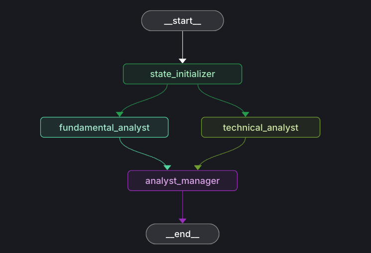

# 🤖 Stocker Analyst Bot

An AI-powered stock analysis system built with LangGraph that combines fundamental and technical analysis to provide comprehensive investment recommendations.

## 🌟 Features

- **🔍 Ticker Extraction**: Automatically extracts stock symbols from natural language input
- **📊 Fundamental Analysis**: Comprehensive financial analysis using Financial Modeling Prep API
- **📈 Technical Analysis**: Technical indicators and market sentiment analysis
- **🧠 AI-Powered Synthesis**: Combines both analyses for balanced investment recommendations
- **⚡ LangGraph Architecture**: Stateful, multi-agent system with parallel processing

## 🏗️ Architecture

```
                    📥 User Input
                         │
                         ▼
                🎯 State Initializer
                   (Extract Ticker)
                         │
                    ┌────┴────┐
                    ▼         ▼
          📊 Fundamental   📈 Technical
             Analyst        Analyst
                    │         │
                    └────┬────┘
                         ▼
                🧠 Analyst Manager
                (Synthesize Reports)
                         │
                         ▼
                📋 Final Recommendation
```



### Components:
- **State Initializer**: Extracts ticker symbols using LLM
- **Fundamental Analyst**: Analyzes financial data (income statements, ratios, growth metrics)
- **Technical Analyst**: Evaluates price action and technical indicators
- **Analyst Manager**: Synthesizes both reports into final investment recommendation

## 🚀 Getting Started

### Prerequisites
- Python 3.8+
- OpenAI API key
- Financial Modeling Prep API key

### Installation

1. Clone the repository:
```bash
git clone https://github.com/yourusername/stocker-analyst-bot.git
cd stocker-analyst-bot
```

2. Create virtual environment:
```bash
python -m venv .venv
source .venv/bin/activate  # On Windows: .venv\Scripts\activate
```

3. Install dependencies:
```bash
pip install -r requirements.txt
```

4. Set up environment variables:
```bash
cp .env.example .env
# Edit .env with your API keys
```

### Environment Variables

Create a `.env` file with:
```
OPENAI_API_KEY=your_openai_api_key_here
FMP_API_KEY=your_financial_modeling_prep_api_key_here
```

## 💡 Usage

### Basic Usage
```python
from analyst_manager import graph
from langchain_core.messages import HumanMessage

# Analyze a stock
messages = [HumanMessage(content="analyze AAPL")]
result = graph.invoke({"messages": messages})

print(result)
```

### Example Output
```json
{
  "final_recommendation": "BUY",
  "confidence": "HIGH",
  "growth_score": {"score": 8, "justification": "Strong revenue growth and market expansion"},
  "risk_score": {"score": 4, "justification": "Low debt levels and stable cash flow"},
  "short_summary": "Apple shows strong fundamentals with positive technical momentum, making it a good long-term investment.",
  "detailed_analysis": {
    "fundamental_highlights": ["Revenue growth of 15%", "Strong balance sheet"],
    "technical_highlights": ["Bullish breakout pattern", "RSI in healthy range"],
    "risks": ["High valuation multiples", "Market volatility"],
    "catalysts": ["New product launches", "Services growth"],
    "price_target": "$180-200",
    "investment_timeline": "long-term"
  }
}
```

## 🧪 Development

### Run with LangGraph Dev Server
```bash
langgraph dev
```

### Project Structure
```
stocker-analyst-bot/
├── analyst_manager.py      # Main orchestration logic
├── fundamental_agent.py    # Fundamental analysis agent
├── technical_analyst.py    # Technical analysis agent
├── analyst_states.py       # State definitions
├── utils/
│   ├── fundamental_analysis_tool.py
│   └── technical_analysis_tool.py
└── requirements.txt
```

## 🤝 Contributing

1. Fork the repository
2. Create a feature branch (`git checkout -b feature/amazing-feature`)
3. Commit your changes (`git commit -m 'Add amazing feature'`)
4. Push to the branch (`git push origin feature/amazing-feature`)
5. Open a Pull Request

## 📄 License

This project is licensed under the MIT License - see the [LICENSE](LICENSE) file for details.

## 🔗 API Credits

- **Financial Data**: [Financial Modeling Prep](https://financialmodelingprep.com/)
- **AI Models**: [OpenAI](https://openai.com/)
- **Framework**: [LangGraph](https://langchain-ai.github.io/langgraph/)

## ⚠️ Disclaimer

This tool is for educational and research purposes only. Not financial advice. Always do your own research before making investment decisions.
